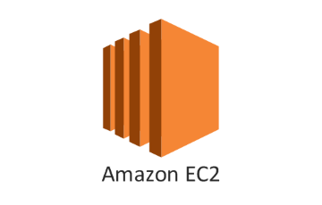
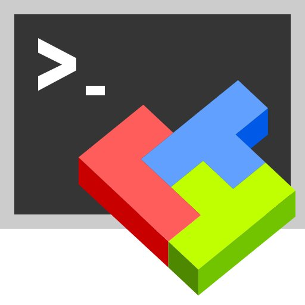

# 소개 영상

https://youtu.be/pkf5tdeBogI

# 프로젝트 진행 기간

2023.02.20 - 2023.04.07 - 약 7주

# 프로젝트 소개

컨텐츠 기반 추천을 통해 나만의 1면!!!

# 메인기능

- 뉴스 추천 기능을 활용한 나만의 신문 1면을 보여준다.
- 유저 스크랩 북 관리 기능

# 세부사항

- 컨텐츠 기반 뉴스 추천
- 품질 평가를 통과한 기사만 노출
- 편리한 스크랩 북 관리, 헤드라인 제목과 시간 순으로 정렬하는 기능 등 유저 경험 개선

# 시스템 구성

# 기술 스택

## 공통

이슈 관리 : Jira

형상 관리 : Git

협동 툴 : Mattermost, Webex, Notion

Server : AWS EC2 `Ubuntu 20.04 LTS`
 

## FE

기술 스택(버전) : React `18.2.0`, React-router-dom `6.9.0`, axios `1.3.4`, recoil `0.7.7`

사용 툴 : visual studio

## C. BE

### i. WAS (Web Application Server)

기술 스택(버전) : openjdk `11`, Spring boot `2.7.9`, OAuth2, Kakao,

사용 툴 : IntelliJ

### ii. CRS (Contents Recommendation Server)

기술 스택(버전) : Python3 `3.9.2`, fastapi `0.95.0`, uvicorn `0.21.1`, SQLAlchemy `2.0.8`, PyMySQL `1.0.3`, numpy `1.24.2`, gensim `4.3.1`, pytest `7.1.2`
사용 툴 : PyCharm `2022.3.2`

### iii. DevOps

기술 스택 : Nginx, Jenkins, Docker

사용 툴 : Mobaxterm

## D. DATA

### i. 크롤링

기술 스택(버전) : Python3 `3.9.2`
, MongoDB `4.2`, Crontab, Sehll Script

### ii. 빅데이터 추천 모델

기술 스택(버전) : Python `3.9` , Numpy `1.24`, Pandas `1.5`, konlpy `0.6`, gensim `4.3.1`, seaborn `0.12`, matplotlib `3.7`, pyLDAvis `3.4` , MongoDB `4.2`
사용 툴 : JupyterNotebook `5.3` , MongoDB, JVM

### iii. 검색 시스템

기술 스택 : ElasticSearch 7.15.7, Monstache

### 역할

- 강승곤: BE,FE 팀장
- 서주광: BE 회원 권한에 따른 사용 기능 제한 필터 구현
- 윤상빈: BE 기본 API 개발
- 윤소희: BE 데이터 수집, 전처리, Logging, Data Monitoring, Fast API 개발
- 홍영민: BE 추천 모델 개발, Data Monitoring, Fast API, FE 개발
- 이안채: BE CI/CD 자동화, 배포 환경 구축, 검색 시스템, Data 동기화
